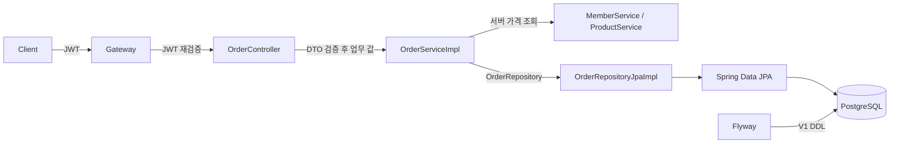

# 12. PostgreSQL · JPA · Flyway · Testcontainers

11단계의 member/product 조회와 주문 견적에 실제 저장소를 연결합니다.
기본 `local`은 기존 메모리 저장소, `local,persistence`는 PostgreSQL을 사용합니다.
`persistence`는 lifecycle profile을 대체하는 이름이 아니라 저장소 선택용 추가 profile입니다.
dev/staging/prod는 기본 JPA이며 DB_URL/DB_USERNAME/DB_PASSWORD가 필수입니다. API는 모든 프로필에서 같습니다.

## 요청과 저장 흐름



1. SecurityFilterChain은 JWT 인증, Controller 메서드 보안은 api.write/api.read 권한을 검사합니다.
2. Controller가 입력 DTO를 검증합니다. 소유자는 요청 JSON 대신 검증된 JWT의 subject를 사용합니다.
3. OrderServiceImpl.place의 `@Transactional`이 회원·상품 조회, 견적 계산, 저장을 묶습니다.
4. Repository adapter가 model record를 JPA Entity로 변환합니다. `saveAndFlush` 후에도 commit 전 실패하면 rollback됩니다.
5. MapStruct가 model → 응답 DTO를 변환합니다. requestId는 응답 추적용이며 업무 Service로 전달하지 않습니다.

Entity와 Spring Data Repository는 각 feature의 repository/jpa에 있습니다. ServiceImpl은 저장소 인터페이스와 model을 사용합니다.
회원/상품 Entity 간 lazy 연관관계를 추가하지 않고 주문에는 참조 ID와 상품명/가격 snapshot을 저장합니다.
FK는 존재하지 않는 회원/상품을 참조한 주문과 참조 중인 부모의 삭제를 차단합니다.
총액은 저장된 단가 × 수량으로 계산하므로 상품 가격이 바뀌어도 기존 주문 금액이 유지됩니다.

## 설정과 migration

| 설정 | 의미 |
|---|---|
| 기본 local | DB 자동 구성 제외, 고정 메모리 저장소 사용; 앞 단계/기존 kind 실습 유지 |
| local,persistence | mock=false, persistence=true; JPA adapter와 주문 저장 API 등록 |
| DB_URL/DB_USERNAME/DB_PASSWORD | Compose environment → Spring DataSource; `.env` 자체를 Spring이 읽지 않음 |
| Flyway V1 | 테이블·CHECK·FK·인덱스 생성, schema history에 버전/checksum 기록 |
| ddl-auto=validate | Hibernate는 일치 여부만 검사; DDL 변경은 Flyway 담당 |
| open-in-view=false | HTTP 응답을 만들 때 추가 SQL이 발생하지 않도록 transaction 안에서 model 변환 완료 |
| Hikari max=5, min=1, timeout=3000ms | 로컬 시작값; 실제 운영은 DB 한도와 Pod 수에 맞춰 조정 |
| readiness=readinessState,db,redis | DB 접근 불가 시 트래픽 수신을 멈추도록 설계 |
| liveness=livenessState | DB 장애를 앱 재시작 폭주로 전파하지 않음 |

스키마는 `backend/src/main/resources/db/migration/V1__create_learning_catalog_and_orders.sql`에 있습니다.
이미 적용한 migration을 수정하면 checksum 검증이 실패합니다. 이후 변경은 V2, V3 파일로 추가합니다.
`scripts/sql/learning-catalog.sql`은 JAR/Flyway 경로 밖의 명시적 로컬 seed입니다.
재실행 시 `ON CONFLICT DO NOTHING`으로 기존 수정값과 주문을 보존합니다.

## Compose 실행

저장소 루트의 WSL Bash에서 실행합니다. 다른 프로젝트의 DB/볼륨은 사용하지 않습니다.
기존 `.env`가 없을 때만 `new-local-env.sh`가 생성하고, 다음 스크립트는 DB 비밀번호 항목만 추가합니다.
비밀번호와 JWT를 출력하거나 `.env`를 Git에 넣지 않습니다.

```bash
bash scripts/new-local-env.sh
bash scripts/ensure-persistence-env.sh
docker compose -f docker-compose.yml -f docker-compose.persistence.yml config --quiet
docker compose -f docker-compose.yml -f docker-compose.persistence.yml up -d --build
# Flyway migration과 Backend health가 정상인 뒤 예제 데이터 삽입
docker compose -f docker-compose.yml -f docker-compose.persistence.yml exec -T postgres \
  psql -U feature_lab -d feature_lab -v ON_ERROR_STOP=1 < scripts/sql/learning-catalog.sql
```

DB 이미지는 `postgres:17.11-alpine`, volume은 프로젝트 접두사를 가진 `postgres-data`입니다.
DB의 5432는 호스트에 공개하지 않습니다. PostgreSQL 설정의 localhost와 Compose의 postgres DNS를 구분합니다.
관측 overlay도 실행 중이라면 **Backend를 변경하는 모든 명령**에 해당 파일을 함께 지정하세요.
아래처럼 결합해야 기존 Prometheus 익명 scrape 설정도 유지됩니다. orphan 경고만 보고 `--remove-orphans`를 쓰지 않습니다.

```bash
docker compose -f docker-compose.yml -f docker-compose.observability.yml \
  -f docker-compose.persistence.yml --profile observability up -d --build
```

Swagger를 원하면 `-f docker-compose.learning.yml`도 추가하고 `http://localhost:18081/swagger-ui/index.html`을 엽니다.
업무 호출은 JWT가 필요하고 Backend 직접 호출은 Gateway의 rate limit을 거치지 않습니다.

## 저장과 조회

```bash
source scripts/local-api.sh
lab_login http://localhost:8080
lab_api GET /api/members
lab_api GET /api/products/1
lab_api POST /api/orders/preview '{"memberId":1,"productId":1,"quantity":2}'
# 견적만 계산: 200, totalPrice=100000.00 KRW
created=$(lab_api POST /api/orders '{"memberId":1,"productId":1,"quantity":2}')
order_id=$(printf '%s' "$created" | jq -er '.data.id')
lab_api GET "/api/orders/$order_id"
# 저장은 201, 조회는 200; data.quote에 가격 snapshot, data.id와 createdAt 포함
```

| 요청 | 결과 |
|---|---|
| POST /api/orders | api.write, 201 data/meta |
| GET /api/orders/{UUID} | api.read + JWT 소유자 일치, 200 data/meta |
| 다른 사용자의 주문 / 없는 주문 | 404 ORDER_NOT_FOUND; 존재 여부를 구분해 노출하지 않음 |
| 수량 0/101, 잘못된 DTO | 400 INVALID_REQUEST |
| 인증 누락 / scope 부족 | 401 / 403 |
| 주문 본문에 없는 회원/상품 참조 | 422 INVALID_MEMBER_REFERENCE / INVALID_PRODUCT_REFERENCE, 저장 없음 |
| 메모리 저장소 모드에서 주문 저장/단건 조회 | 같은 API의 201/200. 메모리 저장이므로 재시작 후 소멸 |

회원은 업무 예제 데이터이며 JWT 로그인 계정과 연결하지 않았습니다. 이 단계의 소유권은 **주문**에 적용합니다.
계정 가입·결제·재고 차감·멱등키는 아직 없습니다. 같은 POST를 다시 보내면 별도 주문이 생성됩니다. 이후 [18단계 수정·삭제 예제](18-mybatis-and-sql-queries.md#18-5-주문-수정삭제-crud-완성)에서 메모리·JPA·MyBatis 공통 PATCH 수량 변경과 DELETE 실제 행 삭제를 추가했습니다.
가격/소유자 값을 요청으로 받아 신뢰하지 않으며 서버가 계산합니다. API 호출 중 429는 Gateway 제한입니다.

## 재기동과 데이터 유지

위에서 저장한 order_id를 유지한 채 DB를 재생성하고 다시 조회합니다. 전용 named volume은 그대로 사용합니다.

```bash
docker compose -f docker-compose.yml -f docker-compose.persistence.yml up -d \
  --no-deps --force-recreate --wait postgres
docker compose -f docker-compose.yml -f docker-compose.persistence.yml restart backend
# Backend healthy 확인 후 같은 JWT/order_id로 조회 (토큰 만료 시 lab_login 재실행)
docker compose -f docker-compose.yml -f docker-compose.persistence.yml ps
lab_api GET "/api/orders/$order_id"
```

DB 장애 중에는 readiness가 DOWN이 될 수 있습니다. liveness와 readiness를 혼동하지 않습니다.
저장 데이터를 유지하려면 `down -v`나 `docker volume prune`을 사용하지 않습니다.
기본 메모리 저장소 실습으로 되돌릴 때는 Backend만 기본 Compose로 재생성하고 DB는 중지합니다.

```bash
docker compose -f docker-compose.yml up -d --no-deps --force-recreate backend
docker compose -f docker-compose.yml -f docker-compose.persistence.yml stop postgres
```

volume에 데이터가 있으면 `.env`의 POSTGRES_PASSWORD만 바꿔도 DB 사용자의 비밀번호는 바뀌지 않습니다.
운영에서는 migration용 DDL 계정과 앱용 최소 권한 계정을 분리하고 Secret 관리·백업/복원·connection 예산을 보완해야 합니다.
이 로컬 예제는 한 계정으로 초기화/migration/앱 연결을 학습합니다. DB가 생겼다고 Pod에 세션 상태를 저장하지 않습니다.
Kubernetes PostgreSQL StatefulSet/Secret/PVC 배포는 이 단계의 Compose 구현과 별도이며 기존 kind 매니페스트는 메모리 저장소 모드입니다.

## 자동 검증과 코드 읽기 순서

```bash
# Docker 없이 이전 단계 회귀 검증
MANAGEMENT_OTLP_METRICS_EXPORT_ENABLED=false bash ./gradlew --no-daemon \
  --project-cache-dir "$HOME/.gradle/project-caches/spring-gateway-docker-sample" :backend:test :gateway:test
# Docker 필요: 임시 PostgreSQL과 임의 호스트 포트, 종료 후 Testcontainers가 정리
MANAGEMENT_OTLP_METRICS_EXPORT_ENABLED=false bash ./gradlew --no-daemon \
  --project-cache-dir "$HOME/.gradle/project-caches/spring-gateway-docker-sample" :backend:databaseTest
```

databaseTest는 기본 test와 분리했습니다. CI에서도 두 작업을 명시적으로 실행해야 전체 검증입니다.
Docker가 없으면 실패하며 조용히 건너뛰지 않습니다. 테스트 DB는 Compose DB와 다른 임시 컨테이너입니다.
검증 항목: 빈 DB Flyway 초기화/seed 분리, JPA 조회, 201 저장, JWT 소유권, 400/401/403/404,
flush 후 실제 rollback, DB CHECK/FK, 상품 변경 후 주문 snapshot 유지입니다.

코드는 아래 순서로 읽습니다. 주요 진입점 주석은 동작을 반복 설명하기보다 경계와 설정 이유를 설명합니다.

1. 조회: MemberController/MemberDtoConverter → MemberService → MemberServiceImpl → MemberRepository.
2. 저장소 교체: repository의 @Profile → MemberRepositoryJpaImpl 또는 MemoryMemberRepository.
3. 주문: OrderController → OrderService → OrderServiceImpl → MemberService/ProductService 및 OrderRepository.
   public place의 쓰기 트랜잭션과 get의 readOnly·소유자 조건을 유지합니다. [13단계](13-feature-boundaries-and-growth.md)에 공개 경계를 설명합니다.
4. 데이터: V1 migration → application-persistence.yml → scripts/sql/learning-catalog.sql.
5. 검증: ArchitectureTest → order/repository/jpa/OrderPersistenceIntegrationTest의 rollback/소유권/snapshot 테스트.

공식 참고: [Boot DB 초기화](https://docs.spring.io/spring-boot/how-to/data-initialization.html),
[Testcontainers PostgreSQL](https://java.testcontainers.org/modules/databases/postgres/),
[PostgreSQL 지원 버전](https://www.postgresql.org/support/versioning/).
Boot 4.0.8 BOM으로 JPA/Flyway/JDBC/Testcontainers 버전을 맞추며 PostgreSQL 이미지 버전은 명시적으로 고정했습니다.

## 단계 체크

- [ ] mock/persistence profile을 바꿔 같은 회원/상품 API의 저장소만 교체됨을 확인했다.
- [ ] Entity, 순수 model, 외부 DTO와 DtoConverter와 저장소 변환의 책임을 구분했다.
- [ ] Flyway migration과 학습 seed의 목적/실행 시점이 다름을 설명했다.
- [ ] 200 견적과 201 주문 저장을 구분하고 소유권 조회 조건을 확인했다.
- [ ] flush와 commit 차이, 예외 발생 시 rollback을 테스트에서 추적했다.
- [ ] DB CHECK/FK가 DTO 검증과 별도로 필요한 이유를 설명했다.
- [ ] DB 컨테이너 재생성 후 같은 주문이 유지되는 것을 확인했다.
- [ ] DB 장애의 readiness와 앱 liveness, 운영 계정/백업 후속 과제를 구분했다.


## 실제 검증 기록 (2026-09-29)

- 자동 테스트: Backend 회귀 46개 + PostgreSQL 통합 6개 + Gateway 53개 = **105개 통과**, 실패·오류·건너뜀 0.

- DB 통합 테스트는 별도 임시 PostgreSQL에서 실행했으며 Flyway V1, seed 미주입, JPA 조회, 주문 소유권, 실제 flush 후 rollback, CHECK/FK와 가격 snapshot을 확인했습니다.
- 실제 Compose 전용 PostgreSQL 17.11 / postgres-data volume을 생성했습니다. 기존 Gateway·Redis·관측 서비스는 유지하고 Backend를 새 이미지로 교체했습니다.
- Gateway 경로로 회원/상품 조회 200, 주문 저장 201, 본인 주문 조회 200과 총액 100000 KRW를 확인했습니다.
- DB 컨테이너를 같은 named volume으로 재생성하고 Backend를 재기동한 뒤 같은 주문 ID/금액의 조회 200을 확인했습니다.
- 실제 DB의 Flyway V1 success=true, Backend/PostgreSQL healthy, Prometheus의 Gateway/Backend target 모두 UP을 확인했습니다.
- 현재 Backend는 local,persistence와 기존 observability overlay 조합으로 실행 중입니다. 신규 예제 회원·상품과 검증용 주문 1건이 전용 DB에 남아 있습니다.
- 단계 체크박스는 학습자 직접 확인용입니다. Kubernetes DB 배포·장애 중 readiness 전환·백업 복원·브라우저 Swagger 조작은 이번 실행 검증에 포함하지 않았습니다.


> 현재 구조 보완: [17단계](17-reference-architecture.md). 기능 flag 제거, 단일 주문 API, feature 경로 Bean/메서드 권한, 기능별 오류 코드, 공유 모듈과 루트 빌드를 적용했습니다. 이전 단계의 검증 수는 당시 기록입니다.
