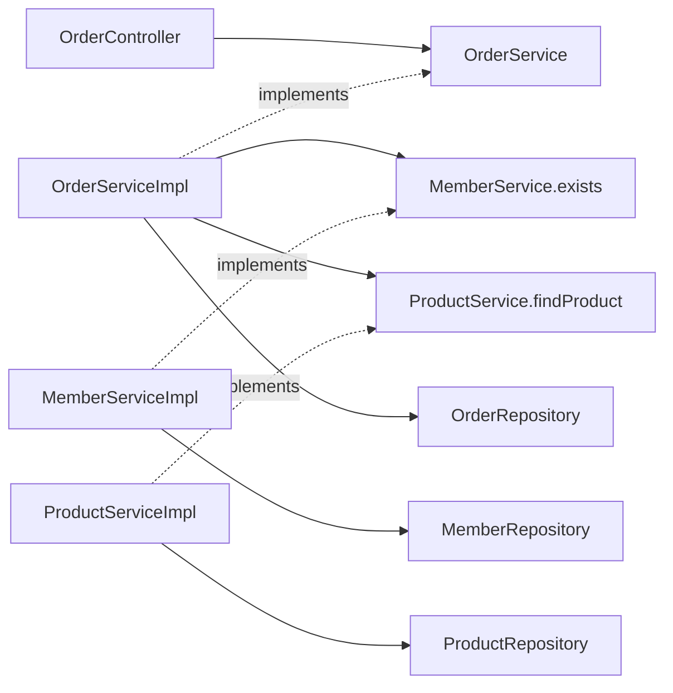

# 13. Feature 확장과 기능 간 협력

2026-10-01의 [구조 전환](../egov-style-restructure-review.md)을 적용한 설명입니다. 현재 배치의 기준은 [패키지 구조](../package-structure.md)입니다.
member/product/order 등 기능 이름은 유지하고 내부를 web/service/repository/model/error로 정리했습니다. HTTP `/members`의 복수형과 Java 패키지의 단수형은 다른 기준입니다.

## 하위 패키지와 새 기능을 고르는 기준

| 상황 | 배치 | 기준 |
|---|---|---|
| HTTP DTO가 늘어남 | web/dto/request·response | 같은 업무 안의 역할 분류 |
| 저장소 구현이 둘 이상 | repository의 Memory*Repository와 jpa/·mybatis/ | 업무와 구현 기술 분리 |
| 회원 주소·연락처 | member 내부부터 시작 | 독립 생명주기가 생길 때 분리 |
| 주문 조회·저장 | OrderServiceImpl의 get/place | 메서드별 트랜잭션과 권한 책임 유지 |
| 결제 승인·취소·정산 | payment 기능 | 독립 업무와 외부 연동 책임 |
| 기능들을 조합한 화면 | 실제 필요한 상위 조회 서비스 | 기존 기능의 양방향 순환 방지 |

파일 수만으로 기능을 나누지 않습니다. 요구가 없는 DAO, Entity, 전달용 Facade를 만들지 않습니다.

## 현재 구조와 호출

```text
member/                         product도 같은 기본 배치
├── web/                        Controller, Routes, DtoConverter, dto/
├── service/                    MemberService
│   └── impl/MemberServiceImpl
├── repository/                 MemberRepository
│   ├── MemoryMemberRepository
│   └── jpa/                    MemberRepositoryJpaImpl, MemberJpaRepository, MemberEntity
├── model/Member
└── error/MemberErrorCode

order/
├── web/                        OrderController, Routes, DtoConverter, dto/request·response
├── service/                    OrderService (preview/place/get)
│   └── impl/OrderServiceImpl
├── repository/                 OrderRepository, MemoryOrderRepository, jpa/, mybatis/
├── model/                      OrderQuote, StoredOrder
└── error/OrderErrorCode
```



Controller는 OrderService 인터페이스를 주입받습니다. OrderServiceImpl이 회원·상품의 공개 Service와 자기 저장소를 사용합니다. JVM 내부 호출이므로 자신에게 HTTP 요청을 보내지 않습니다.
기존 MemberLookup/ProductLookup, OrderCatalog/LocalOrderCatalog와 중복 snapshot 변환은 통합했습니다.

## 다른 기능에 공개하는 계약

| 계약 | 위치와 의미 |
|---|---|
| MemberService.exists | member.service, 존재 여부 boolean |
| ProductService.findProduct | product.service, Optional로 부재 전달 |
| ProductSnapshot | product.service, 상품 ID·이름·가격·통화의 불변 조회 값 |
| Repository | 자기 기능 내부 저장 계약, 다른 기능에 공개하지 않음 |
| model / web.dto / Entity | 내부 업무·HTTP·DB 목적을 구별하며 기능 간 계약으로 재사용하지 않음 |

외부 공개 범위는 `product.service` 같은 직속 패키지입니다. `service.impl`까지 허용하는 `..service..` 패턴을 쓰지 않습니다.
ProductServiceImpl이 내부 Product를 ProductSnapshot으로 변환하며 Repository는 service를 참조하지 않습니다.
같은 기능의 web을 위한 list/get 메서드의 내부 model 반환은 기능 간 사용 대상이 아닙니다.
회원·상품이 없으면 주문은 422 INVALID_MEMBER_REFERENCE/INVALID_PRODUCT_REFERENCE로 해석합니다. 회원·상품 get의 404로 바꾸지 않습니다.

## 서로 참조해야 할 때

**업무상 협력과 코드의 양방향 의존은 구분합니다.** 현재 방향은 order → member/product입니다.
나중에 회원 상세 화면에서 주문 요약이 필요하다고 MemberService가 OrderService를 직접 호출하면 순환이 생깁니다.

1. 화면 조합이 목적이면 member와 order 양쪽의 공개 조회 계약을 부르는 상위 조회 use case를 둡니다.
   실제 독립 조회 책임이 생기면 customeroverview 같은 feature로 만들고, member가 order를 호출하게 만들지 않습니다.
2. 여러 기능의 상태 변경을 묶는 업무라면 그 업무를 소유한 orchestration Service를 둡니다.
   단일 DB의 동기 작업은 상위 public Service transaction에서 처리할 수 있습니다.
3. 즉시 결과가 필요 없는 후속 작업(예: 주문 완료 후 알림)은 공개 이벤트로 분리할 수 있습니다.
   단순 AFTER_COMMIT listener는 전달 보장을 제공하지 않습니다. 유실 방지가 필요하면 outbox·재시도·중복 처리 정책이 필요합니다.
4. 두 feature가 항상 함께 변경되고 분리할 규칙이 없다면 잘못 나눈 경계인지 검토합니다.

인터페이스로 바꾸기만 해도 A → B → A 순환은 남습니다. `@Lazy`, 순환 참조 허용 설정이나 common 이동으로 숨기지 않습니다.
위 customeroverview/payment/inventory/이벤트 처리는 **확장 판단 예시**이며 이번에 구현한 새 기능은 아닙니다.

## transaction·데이터·조회 현실 고려

- 현재 OrderServiceImpl.place의 transaction은 같은 DataSource의 회원/상품 조회와 주문 INSERT에 참여합니다.
  조회는 조회 순간의 가격을 읽고 주문 snapshot으로 저장합니다. 재고 예약/결제 정합성은 아직 구현하지 않았습니다.
- 다른 feature의 Entity/Repository를 직접 가져와 상태를 바꾸지 않습니다. 해당 feature의 공개 업무 연산이 검증을 책임집니다.
- 하나의 DB라도 테이블 소유권은 유지합니다. 현재 FK는 단일 DB 안의 참조 무결성을 보장하지만 schema 수준의 결합은 남습니다.
  향후 서비스를 분리하면 FK/공유 transaction이 그대로 유지된다고 가정하지 않습니다.
- 원격 결제 호출은 로컬 DB rollback으로 되돌릴 수 없습니다. timeout·멱등키·상태 전이·보상/재처리를 별도 설계합니다.
- 대량 목록에서 다른 feature를 행마다 호출하면 N+1 호출이 생길 수 있습니다. 공개 batch 조회 계약 또는 명시적인 읽기 모델을 검토합니다.
  성능 때문에 SQL join을 도입한다면 projection 소유권·schema 의존·검증을 문서화하고 쓰기 경계는 유지합니다.
- 새 HTTP endpoint를 만들면 패키지만 추가하지 않고 기능 web의 FeatureRoutes 경로 등록/메서드 권한과 service 소유권 검증도 추가합니다.

## 자동 검사와 검증

Backend ArchitectureTest가 기능 패키지를 자동 발견하고 다음을 검사합니다.

- 서비스·저장소가 web에 의존하지 않음, 저장소가 service에 의존하지 않음.
- 다른 기능의 직속 service만 사용하며 구현체·저장소·model에 직접 접근하지 않음.
- 공개 서비스에 구현/영속성 타입이 노출되지 않음, 공개 record가 내부 model·Entity를 포함하지 않음.
- common/platform-core → 기능 참조와 기능 간 순환 금지.
- HTTP handler 메서드 권한 선언과 검사 대상이 존재함.

이 규칙은 팀의 구조 선택이며 Spring의 필수 패키지 규약이 아닙니다. public 접근 제어만으로 지켜지지 않으므로 테스트를 실행해야 합니다.

```bash
bash ./gradlew :libs:platform-core:test :backend:test :gateway:test
bash ./gradlew :backend:databaseTest
```

DB 테스트는 일회용 PostgreSQL/Redis를 사용합니다. OrderServiceImpl.place를 호출자 트랜잭션 없이 호출해 실제 INSERT/flush 후 실패를 만들고 rollback을 확인합니다. get의 readOnly와 소유자 조건도 검증합니다. API 경로·JSON·Flyway migration은 유지합니다.
이미지 갱신은 기존 Compose 조합과 볼륨을 유지하는 scripts/reference-stack.sh를 사용합니다.

## 단계 체크

- [ ] Controller → Service 인터페이스 → Impl → 자기 Repository를 추적했다.
- [ ] ProductSnapshot은 공개 service, Product는 내부 model에 둔 이유를 설명했다.
- [ ] 저장소가 service를 참조하면 안 되는 이유와 변환 위치를 설명했다.
- [ ] 404 단건 조회와 422 주문 참조 오류를 구별했다.
- [ ] 생성·조회 통합 후에도 소유권·트랜잭션·금액 계산이 유지됨을 확인했다.
- [ ] 단일 DB rollback과 원격 결제 실패 처리의 차이를 설명했다.

아래는 이전 구조의 검증 이력이며 현재 테스트 수나 패키지 배치를 의미하지 않습니다.

## 검증 기록 (2026-09-29)

- Backend 일반 52개(ArchUnit 9개 포함) + 임시 PostgreSQL 통합 6개 통과. 변경 없는 Gateway 53개는 기존 통과 결과를 재사용했습니다. 합계 111개, 실패·오류·건너뜀 0.
- 패키지 이동 전 산출물을 clean한 뒤 컴파일했으며 당시 contract/command/query/adapter 구조로 fixture HTTP와 DB HTTP/소유권/rollback/snapshot 검증을 통과했습니다.
- 계약 연결 테스트에서 소수 금액 0.10 × 3 = 0.30과 통화 유지, 회원 검증 실패 시 상품 호출 중단을 확인했습니다.
- HTTP 경로/JSON 응답과 Flyway migration은 변경하지 않았습니다. 운영 중인 로컬 Compose 이미지는 이번 구조 변경으로 재배포하지 않았습니다.
- 위 판단 예시의 payment/inventory/화면 조합 feature, 원격 호출, 이벤트/outbox는 구현하지 않았습니다. 해당 책임이 생겼을 때 적용할 확장 기준입니다.


> 현재 구조 보완: [17단계](17-reference-architecture.md). 기능 flag 제거, 단일 주문 API, feature 경로 Bean/메서드 권한, 기능별 오류 코드, 공유 모듈과 루트 빌드를 적용했습니다. 이전 단계의 검증 수는 당시 기록입니다.
