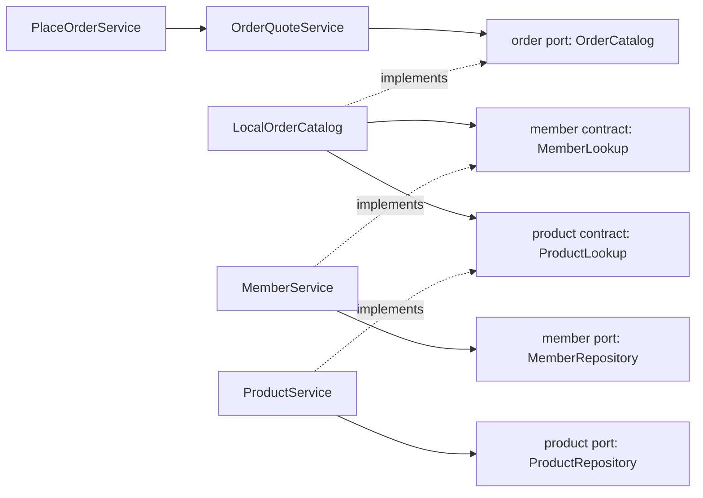

# 13. Feature 확장과 기능 간 협력

패키지의 파일 수가 늘어났다고 이름을 복수형으로 바꾸지는 않습니다.
이 프로젝트에서는 `member`, `product`, `order`와 `api`, `application`, `domain`, `infrastructure`를 유지합니다.
이름의 단수/복수는 팀 규칙이며 기능 크기를 나타내는 표식이 아닙니다. HTTP `/members` 경로의 복수형과도 별개입니다.

## 하위 패키지와 새 feature를 고르는 기준

| 실무 상황 | 선택 | 이유 |
|---|---|---|
| 회원 조회 Service/DTO가 늘어남 | member/application/query, api/dto/request·response | 같은 업무 안의 역할 분류 |
| 회원 주소·연락처 관리 | member 안에 먼저 배치; 복잡해질 때 address 하위 책임 분리 | 회원 생명주기에 강하게 묶임 |
| DB 구현과 fixture가 섞임 | infrastructure/persistence, fixture | 업무 변경 없이 기술 구현 분류 |
| 다른 feature 또는 외부 서비스 연동 증가 | infrastructure/integration 또는 client | 호출 경계와 장애 정책을 찾기 쉽게 분리 |
| 주문 저장과 조회의 권한/처리가 달라짐 | order/application/command·query | 실제 유스케이스와 transaction 책임 분리 |
| 결제 승인/취소/정산 도입 | payment feature | 독립된 상태·규칙·외부 연동·변경 이유가 생김 |
| 여러 창고의 예약/입출고/재고 조정 | inventory feature | 상품 설명/가격과 다른 업무 생명주기 |
| 주문·결제·배송 전체 흐름 조정 | checkout 등 상위 유스케이스가 실제로 필요할 때 추가 | 하위 기능끼리 서로 호출하는 순환을 피함 |

같은 회원 주소라도 배송 라우팅/지리정보처럼 독립 업무로 성장하면 별도 feature가 적합할 수 있습니다.
파일 개수 하나만으로 결정하지 않고 용어, 데이터 소유권, transaction 경계, 변경 이유를 함께 봅니다.
작은 CRUD에 모든 하위 패키지를 미리 만들지 않습니다. hello와 Gateway auth는 현재 크기에 맞는 기존 구조를 유지합니다.

## 현재 반영한 구조

```text
member/                                  product도 같은 분류
├── api/
│   └── dto/                             HTTP 응답 (현재는 더 나눌 필요 없음)
├── contract/                            MemberLookup: 다른 feature가 사용할 공개 Java 계약
├── application/
│   ├── MemberService                    내부 업무 서비스, MemberLookup 구현
│   └── port/MemberRepository            member가 필요한 저장소 계약
├── domain/Member
└── infrastructure/
    ├── fixture/FixtureMemberRepository
    └── persistence/                     JPA Entity, Spring Data Repository, adapter

order/
├── api/
│   └── dto/
│       ├── request/                     생성/견적 입력
│       └── response/                    저장 결과/견적 응답
├── application/
│   ├── command/PlaceOrderService        저장 transaction
│   ├── query/OrderQuoteService          견적
│   ├── query/OrderQueryService          본인 주문 조회
│   └── port/                            OrderCatalog, OrderRepository
├── domain/                              OrderQuote, StoredOrder
└── infrastructure/
    ├── integration/LocalOrderCatalog    회원·상품 공개 계약 연결
    └── persistence/                     주문 JPA 구현
```

모든 feature에 contract가 필요한 것은 아닙니다. 현재 다른 feature가 order를 호출하지 않으므로
order/contract와 의미 없는 OrderFacade는 만들지 않았습니다. 필요가 생길 때 필요한 연산만 공개합니다.
`command/query`는 같은 앱·같은 DB 안의 책임 분리이며 별도 읽기 DB나 이벤트 동기화를 쓰는 CQRS 시스템은 아닙니다.

## contract와 port는 어느 쪽의 계약인가?

| 위치 | 소유자와 의미 |
|---|---|
| member/contract/MemberLookup | 회원이 외부 feature에 제공하는 기능: 회원 존재 검증 |
| product/contract/ProductLookup, ProductSnapshot | 상품이 제공하는 조회와 불변 결과 |
| order/application/port/OrderCatalog | 주문이 자신의 업무를 위해 요구하는 기능 |
| order/infrastructure/integration/LocalOrderCatalog | 상대 contract를 호출하고 주문 port의 값으로 변환하는 연결 구현 |
| api/dto | HTTP 클라이언트용 입력/응답. feature 간 계약으로 재사용하지 않음 |



실제 호출은 주문 Service → 주입된 LocalOrderCatalog → 주입된 회원/상품 Service → 해당 저장소입니다.
컴파일 의존성은 위 인터페이스를 경유합니다. 내부 모듈 호출이므로 자신에게 HTTP 요청을 보내지 않습니다.
현재 MemberService가 contract를 직접 구현하므로 전달만 하는 Facade 클래스를 추가하지 않았습니다.
여러 use case를 조합해야 공개 연산 하나가 완성될 때 contract 구현용 Facade를 분리할 수 있습니다.

ProductSnapshot은 공개 경계의 값이며 Product Entity/domain 객체를 노출하지 않습니다.
LocalOrderCatalog가 이를 주문 소유의 OrderCatalog.ProductSnapshot으로 변환합니다.
같은 필드가 일부 반복돼도 각 기능의 변경 범위를 분리하는 목적이 있습니다. 전 feature의 DTO를 common에 모으지 않습니다.
회원 검증 실패는 기존 BusinessException/NOT_FOUND 흐름으로 끝나며 다음 상품 조회/주문 저장으로 넘어가지 않습니다.

## 서로 참조해야 할 때

**업무상 협력과 코드의 양방향 의존은 구분합니다.** 현재 방향은 order → member/product입니다.
나중에 회원 상세 화면에서 주문 요약이 필요하다고 MemberService가 OrderService를 직접 호출하면 순환이 생깁니다.

1. 화면 조합이 목적이면 member와 order 양쪽의 공개 조회 계약을 부르는 상위 조회 use case를 둡니다.
   실제 독립 조회 책임이 생기면 customeroverview 같은 feature로 만들고, member가 order를 호출하게 만들지 않습니다.
2. 여러 기능의 상태 변경을 묶는 업무라면 그 업무를 소유한 orchestration Service를 둡니다.
   단일 DB의 동기 작업은 상위 public Service transaction에서 처리할 수 있습니다.
3. 즉시 결과가 필요 없는 후속 작업(예: 주문 완료 후 알림)은 공개 이벤트로 분리할 수 있습니다.
   단순 AFTER_COMMIT listener는 전달 보장을 제공하지 않습니다. 유실 방지가 필요하면 outbox·재시도·중복 처리 정책이 필요합니다.
4. 두 feature가 항상 함께 변경되고 분리할 규칙이 없다면 잘못 나눈 경계인지 검토합니다.

인터페이스로 바꾸기만 해도 A → B → A 순환은 남습니다. `@Lazy`, 순환 참조 허용 설정이나 common 이동으로 숨기지 않습니다.
위 customeroverview/payment/inventory/이벤트 처리는 **확장 판단 예시**이며 이번에 구현한 새 기능은 아닙니다.

## transaction·데이터·조회 현실 고려

- 현재 PlaceOrderService의 transaction은 같은 DataSource의 회원/상품 조회와 주문 INSERT에 참여합니다.
  조회는 조회 순간의 가격을 읽고 주문 snapshot으로 저장합니다. 재고 예약/결제 정합성은 아직 구현하지 않았습니다.
- 다른 feature의 Entity/Repository를 직접 가져와 상태를 바꾸지 않습니다. 해당 feature의 공개 업무 연산이 검증을 책임집니다.
- 하나의 DB라도 테이블 소유권은 유지합니다. 현재 FK는 단일 DB 안의 참조 무결성을 보장하지만 schema 수준의 결합은 남습니다.
  향후 서비스를 분리하면 FK/공유 transaction이 그대로 유지된다고 가정하지 않습니다.
- 원격 결제 호출은 로컬 DB rollback으로 되돌릴 수 없습니다. timeout·멱등키·상태 전이·보상/재처리를 별도 설계합니다.
- 대량 목록에서 다른 feature를 행마다 호출하면 N+1 호출이 생길 수 있습니다. 공개 batch 조회 계약 또는 명시적인 읽기 모델을 검토합니다.
  성능 때문에 SQL join을 도입한다면 projection 소유권·schema 의존·검증을 문서화하고 쓰기 경계는 유지합니다.
- 새 HTTP endpoint를 만들면 패키지만 추가하지 않고 SecurityConfig의 경로/메서드/scope와 소유권 검증도 추가합니다.

## 자동으로 지키는 규칙

ArchitectureTest는 main 클래스의 최상위 feature를 자동 발견합니다.

- 다른 feature는 상대 contract만 참조할 수 있습니다. application/port도 상대에게는 내부입니다.
- 교차 feature 참조는 호출 feature의 infrastructure/integration에 모읍니다.
- contract와 application/port에 Entity·HTTP DTO·프레임워크 타입이 새어 나오는 것을 차단합니다.
- common → feature, application → api/infrastructure, API → infrastructure와 feature 순환을 차단합니다.
- domain은 Java와 순수 domain 타입만 사용합니다.

이 규칙은 현재 프로젝트의 선택이며 Spring의 필수 패키지 규약은 아닙니다.
public 키워드를 갖는 내부 Service가 있어도 다른 feature에서 가져다 쓰면 ArchUnit이 실패합니다.
별도 Gradle 모듈/JPMS 격리는 아니므로 테스트를 실행해야 위반을 발견합니다.
[Spring Modulith의 공개 인터페이스/내부 구현 구분](https://docs.spring.io/spring-modulith/reference/fundamentals.html)과
같은 취지이며, 현재는 기존 ArchUnit으로 구현했고 Modulith 라이브러리는 설치하지 않았습니다.

```bash
MANAGEMENT_OTLP_METRICS_EXPORT_ENABLED=false bash ./gradlew --no-daemon \
  --project-cache-dir "$HOME/.gradle/project-caches/spring-gateway-docker-sample" \
  :backend:test :backend:databaseTest :gateway:test
```

기존 11단계 fixture와 12단계 PostgreSQL HTTP/rollback 검증도 함께 실행합니다.
DB 테스트에는 Docker가 필요합니다. 패키지 이동은 HTTP 경로/JSON/스키마/DB migration을 변경하지 않습니다.
로컬 이미지를 갱신할 때는 [12단계](12-postgresql-jpa-flyway.md)의 현재 사용하는 Compose overlay 조합을 유지합니다.

## 단계 체크

- [ ] 패키지 이름의 단수/복수와 기능 규모가 무관함을 설명했다.
- [ ] 같은 업무의 하위 분류와 독립 feature 추가를 예제로 구분했다.
- [ ] 제공자 contract와 호출자 port의 소유자를 구분했다.
- [ ] 주문에서 회원·상품 Entity/Service를 직접 참조하지 않는 흐름을 추적했다.
- [ ] 조회와 저장 책임을 나눠도 권한·소유권·transaction 검증이 유지됨을 확인했다.
- [ ] 양방향 요구를 조정 서비스/조회 모델/이벤트 중 무엇으로 해결할지 판단했다.
- [ ] 단일 DB transaction과 원격 호출의 실패 처리가 다름을 설명했다.


## 검증 기록 (2026-09-29)

- Backend 일반 52개(ArchUnit 9개 포함) + 임시 PostgreSQL 통합 6개 통과. 변경 없는 Gateway 53개는 기존 통과 결과를 재사용했습니다. 합계 111개, 실패·오류·건너뜀 0.
- 패키지 이동 전 산출물을 clean한 뒤 컴파일했으며 현재 contract/command/query/adapter 구조로 fixture HTTP와 DB HTTP/소유권/rollback/snapshot 검증을 통과했습니다.
- 계약 연결 테스트에서 소수 금액 0.10 × 3 = 0.30과 통화 유지, 회원 검증 실패 시 상품 호출 중단을 확인했습니다.
- HTTP 경로/JSON 응답과 Flyway migration은 변경하지 않았습니다. 운영 중인 로컬 Compose 이미지는 이번 구조 변경으로 재배포하지 않았습니다.
- 위 판단 예시의 payment/inventory/화면 조합 feature, 원격 호출, 이벤트/outbox는 구현하지 않았습니다. 해당 책임이 생겼을 때 적용할 확장 기준입니다.
