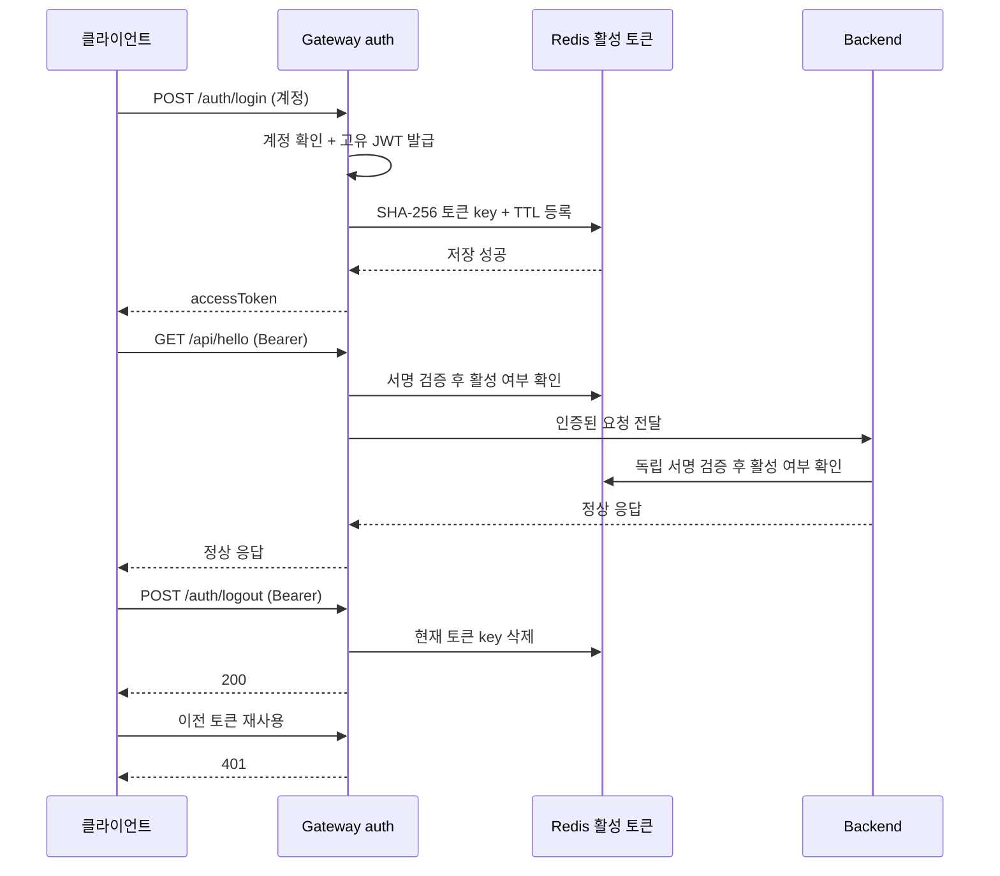

# 14. 로그인·로그아웃과 공유 토큰 상태

> 인증 모드 구분: 이 문서의 HS256/Redis 로그인은 기본 데모 Compose용이다.
> Keycloak 레퍼런스 구성은 [16단계](16-keycloak-and-method-security.md)를 사용한다.
> 현재 Backend는 feature 경로 기본 정책 + 메서드 권한을 사용하며 `/members/admin`은
> `@RequireMemberAdmin`에서 검사한다. 기본 denyAll과 200/401/403 응답 계약은 유지한다.


기존 `lab_login`도 셸에서 JWT를 만든 것이 아니라 Gateway의 `/auth/token`을 호출했습니다.
이제 `/auth/login`을 기본 로그인 API로 사용하고, `/auth/token`은 같은 처리의 호환 별칭입니다.
로그아웃은 클라이언트 변수 삭제에 그치지 않고 Redis의 현재 활성 토큰 기록을 삭제합니다.

## API와 응답

| 요청 | 인증 | 결과 |
|---|---|---|
| `POST /auth/login` | JSON `username`, `password` | `data.accessToken/tokenType/expiresIn` + `meta` |
| `POST /auth/token` | 위와 동일 | 기존 실습 호환 별칭; 동일한 등록 절차 |
| `POST /auth/logout` | `Authorization: Bearer <현재 토큰>` | 200, `data: null` + `meta`; 현재 토큰 삭제 |

두 API 모두 성공 응답에 `Cache-Control: no-store`, `Pragma: no-cache`가 붙습니다.
로그아웃 본문에 사용자명/다른 토큰을 전달하지 않습니다. Security가 검증한 현재 토큰만 삭제합니다.
검증 실패는 400, 잘못된 계정/비밀번호는 401 `INVALID_CREDENTIALS`, 비활성/만료 토큰은 401 `UNAUTHORIZED`입니다.
로그아웃 후 같은 토큰으로 반복 호출하면 인증 단계에서 401입니다. 클라이언트는 로컬 토큰도 버립니다.
Redis 등록/조회/삭제 장애는 503 `SERVICE_UNAVAILABLE`이며 성공으로 처리하지 않습니다.

## 패키지와 요청 흐름

AuthController와 AuthExceptionHandler는 auth.web에 함께 배치합니다. basePackageClasses는 Controller의 패키지를 선택하며 Advice 자신의 위치를 제한하지 않습니다. 인증 enum과 예외는 auth.error에 둡니다. Mono 흐름과 데모/OIDC 조건은 유지합니다.

```text
gateway.auth
  web/AuthController                HTTP DTO 검증, Principal 추출, 공통 응답
  web/AuthExceptionHandler          계정 오류/저장소 장애 응답
  service/LoginService          로그인 등록 / 현재 토큰 종료
  service/TokenService          학습 계정 확인, 고유 jti를 가진 JWT 발급
  repository/LoginSessions    유스케이스가 요구하는 저장 계약
  repository/redis/RedisLoginSessions
                                    common.security.token 저장 구현에 연결
```



`common`은 `auth`를 참조하지 않습니다. 공통 JWT decoder와 auth adapter가 같은 기술 컴포넌트를 사용합니다.
Gateway의 Redis 접근은 reactive Mono이며 `block()`하지 않습니다. Backend는 Servlet 요청 스레드에서
제한된 timeout으로 조회합니다. member/product/order의 Service나 Repository는 인증 코드에서 참조하지 않습니다.
현재 member는 주문 예제용 회원 목록이며 로그인 계정 테이블과 동일한 개념이 아닙니다.

## 상태와 운영 의미

- 앱 JVM에는 HttpSession/WebSession/토큰 캐시를 두지 않습니다. **앱은 stateless지만 인증 시스템은 Redis 공유 상태를 사용합니다.**
- `auth:active:v1:<SHA-256(token)>` → `1`을 JWT 수명만큼 저장합니다. 원문 토큰/비밀번호는 Redis에 저장하지 않습니다.
- Gateway/Backend가 동일 Redis 인스턴스·DB를 사용해야 합니다. prefix/hash는 `libs/platform-core`의 단일 `TokenKey` 구현과 계약 테스트로 맞춥니다.
- JWT 서명/issuer/audience/시간 검증 후 활성 목록을 확인합니다. 이전 버전에서 발급해 등록되지 않은 토큰은 재로그인이 필요합니다.
- 매 로그인마다 jti가 다르므로 같은 계정의 다른 로그인은 유지됩니다. 전체 기기 로그아웃/refresh token은 아직 없습니다.
- Redis key 만료/삭제/휘발성 Redis 재시작 후에는 재로그인이 필요합니다. Redis 장애 시 우회 허용하지 않습니다.
- 로그아웃 완료 후 새 인증 검사에서 거부합니다. 이미 양쪽 검증을 마치고 처리 중인 요청을 취소하는 기능은 아닙니다.
- 두 서비스 readiness에 Redis가 포함됩니다. liveness에는 포함하지 않습니다. persistence profile의 Backend는 DB도 확인합니다.
- Kubernetes Redis ingress는 Gateway와 Backend를 허용합니다. Backend ingress는 Gateway만 허용합니다.
- 저장소 장애 후 재시도는 가능합니다. 로그아웃 응답 유실 뒤에는 이미 삭제되어 401일 수도 있으며, 클라이언트는 이 경우도 로컬 토큰을 정리합니다.

## WSL 실습

저장소 루트에서 기존 Compose 구성으로 **양쪽 이미지를 다시 빌드**한 후 실행합니다.
PostgreSQL/관측 overlay를 사용 중이면 기존 `-f` 조합도 유지합니다.

```bash
source scripts/local-api.sh
lab_login
lab_api GET /api/hello
lab_logout
# 이제 LAB_TOKEN이 없으므로 lab_api는 먼저 로그인하라고 안내합니다.
lab_login
```

이 함수들은 API 호출 예시일 뿐입니다. Postman/프런트엔드에서도 위 표의 HTTP 계약으로 호출할 수 있습니다.
비밀번호/토큰은 명령 인자, 콘솔, 공유 스크린샷에 남기지 않습니다.

## 범위 및 후속 학습

현재 로그인 계정은 기존 `.env`의 `DEMO_USERNAME/DEMO_PASSWORD` 한 개이며 local/dev/test에서만 발급합니다.
운영 profile에서는 데모 로그인 Controller/발급기가 활성화되지 않습니다. 이 Redis 활성 목록은 이 프로젝트의 인증 계약입니다.
외부 OIDC 토큰을 붙일 때는 서명 설정만 바꾸지 말고 발급/철회 방식과 활성 목록 연동을 함께 바꾸어야 합니다.
사용자 DB·비밀번호 해시·로그인 시도 제한·계정 잠금·refresh token·브라우저 로그인 화면은 후속 범위입니다.
현재 API 요청 제한은 인증 후 `/api/**`의 업무 호출에 적용되며 공개 로그인 경로에 적용되는 제한과 다릅니다.

## 체크 사항

- [ ] 셸은 클라이언트이고 실제 계정 확인/토큰 발급은 Gateway라는 점을 설명한다.
- [ ] application → port → infrastructure와 common 인증 검증의 책임을 구분한다.
- [ ] 로그인 → API 200 → 로그아웃 → 같은 토큰 401을 확인한다.
- [ ] 동일 계정의 두 번째 로그인 토큰은 유지됨을 확인한다.
- [ ] Backend 직접 접근에서도 비활성 토큰을 401로 거부한다.
- [ ] Redis 장애의 503과 비활성 토큰의 401을 구분한다.
- [ ] 앱 Pod 교체와 Redis 데이터 유실이 로그인에 미치는 영향을 구분한다.

참고: [Spring Security JWT 검증](https://docs.spring.io/spring-security/reference/reactive/oauth2/resource-server/jwt.html),
[Redis SET 만료 옵션](https://redis.io/docs/latest/commands/set/).
HTTP 보안 테스트는 외부 저장소를 대체하고, DB 통합 테스트는 전용 PostgreSQL/Redis Testcontainers를 사용합니다. 실제 Compose 검증은 아래에 별도로 기록합니다.


## 검증 기록 — 2026-09-29

- Gateway 58개 + Backend 55개 + PostgreSQL/Redis 통합 6개 = **119개 통과**.
- Compose Gateway/Backend 재빌드·기동 완료. 기존 observability/persistence overlay를 유지했고 두 앱/Redis/PostgreSQL healthy, Prometheus 두 target UP을 확인했습니다.
- 실제 로그인 → Gateway/Backend 직접 요청 각각 200 → 로그아웃 200 → 같은 토큰 각각 401을 확인했습니다.
- 별도 로그인 토큰 유지, 토큰 등록 TTL 및 테스트 key 조기 만료 후 401, 잘못된 자격증명 401, DTO 검증 400을 확인했습니다.
- 프로젝트 Redis 중단 시 양쪽 인증과 로그인/로그아웃은 503, 양쪽 liveness는 200을 확인했습니다.
- Redis 복구 후 이전 토큰은 401, 재로그인 후 양쪽 API는 200. 테스트 토큰은 마지막 로그아웃으로 정리했습니다.
- 셸 `lab_login` → `lab_api` 200 → `lab_logout`, `bash -n`, Compose `config --quiet`, local Kustomize 렌더링을 확인했습니다.
- Kubernetes 실제 배포 및 NetworkPolicy CNI 집행은 이번에 실행하지 않았습니다.

실행 중이던 이전 토큰은 재사용하지 말고 `lab_login`으로 다시 발급받습니다.
