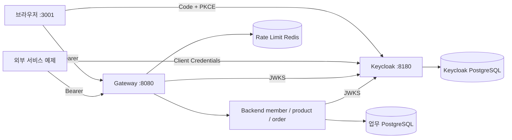

# 16. Keycloak · 메서드 보안 · 외부 서비스 연동

목표: 인증 발급과 업무 서버 책임을 분리하고, feature별 권한 및 Client Credentials를 실습한다.
01~15의 기본 Compose/kind는 HS256 + Redis 활성 토큰 방식이다. 이 단계는 별도 `oidc` profile과 Compose overlay를 사용한다.
Keycloak을 단순히 기존 JWT_ISSUER 값에 넣는 방식이 아니다. decoder·authority 변환·로그아웃 정책이 함께 바뀐다.

## 구성과 책임



- 인증 서버: 비밀번호·사용자 세션·토큰 발급/갱신/로그아웃. Gateway는 OIDC 모드에서 비밀번호를 받지 않는다.
- Gateway: RS256·issuer·audience·시간 검증, 공통 read/write 정책, CORS, 요청 제한, 라우팅.
- Backend: 동일한 JWT를 독립 검증하고 feature 메서드 권한과 주문 소유권을 검사한다.
- JWKS는 검증 공개키 목록이다. 키를 캐시하므로 요청마다 Keycloak에 인증 API를 호출하는 구조가 아니다.
- Redis 활성 목록은 **데모 모드만** 사용한다. OIDC에서 Backend readiness는 DB를 검사하며 인증 때문에 Redis를 조회하지 않는다.
- member/product/order는 같은 Backend의 feature이다. 인증 서버 분리가 업무 feature의 마이크로서비스 분리를 의미하지 않는다.

## 준비 · 기동 · 정지 (WSL Bash, 저장소 루트)

```bash
bash scripts/reference-stack.sh prepare
bash scripts/reference-stack.sh config
bash scripts/reference-stack.sh up
bash scripts/reference-stack.sh status
```

`prepare`는 기존 .env와 PostgreSQL 암호를 보존하고 Keycloak 전용 비밀값만 추가한다.
`up`은 기본 Compose + persistence + Keycloak을 결합한다. Grafana 암호가 있으면 기존 관측 overlay도 유지한다.
기존 Gateway/Backend가 재생성되므로 이미 사용하던 데모 토큰은 이 구성에서 사용할 수 없다.
기존 업무 DB 볼륨을 삭제하지 않는다. 데모의 문자열 sub와 Keycloak의 사용자 UUID sub는 다르므로 이전 주문이 새 사용자 소유가 되지는 않는다.

| 주소 | 목적 |
|---|---|
| http://localhost:3001/ | 브라우저 로그인/로그아웃과 API 권한 실습 |
| http://localhost:8180/ | Keycloak 관리 Console |
| http://localhost:8080 | Gateway API |

반드시 `localhost`를 사용한다. `127.0.0.1`은 Origin/redirect URI가 달라 동일한 주소로 취급하지 않는다.
모든 공개 포트는 호스트 loopback에 묶여 있으며 DB 포트와 Keycloak health 관리 포트는 공개하지 않는다.

```bash
# 데이터 삭제 없이 정지한다. 다시 up 하면 재시작한다.
bash scripts/reference-stack.sh stop
```

01~15 데모 모드로 돌아가려면 `stop` 후 해당 단계의 Compose 명령으로 Gateway/Backend를 다시 생성한다.
`docker compose down -v`로 realm/업무 데이터를 지우지 않는다. Kubernetes 기본 매니페스트는 아직 데모 모드이며 이 Compose overlay로 자동 변경되지 않는다.

## 사용자 로그인/로그아웃

브라우저 화면에서 **Keycloak 로그인**을 누른다. Keycloak 화면에서 로그인한 뒤 원래 화면으로 돌아온다.
공식 keycloak-js가 Authorization Code, state/nonce, S256 PKCE, 토큰 갱신을 처리한다.
Access/Refresh Token은 메모리에만 보관하며 localStorage·로그·화면에 출력하지 않는다.

| 사용자 | .env 암호 필드 | 권한/기대 결과 |
|---|---|---|
| demo | KC_DEMO_PASSWORD | 일반 회원/상품 200, 관리자 회원 403 |
| lab-admin | KC_LAB_ADMIN_PASSWORD | 일반 회원/상품 200, 관리자 회원 200 |
| lab-bootstrap | KC_BOOTSTRAP_PASSWORD | master realm 관리용. 업무 사용자 계정과 별개 |

`/auth/login`, `/auth/token`, `/auth/logout`의 JSON API는 이전 **데모 모드 전용**이다.
OIDC 로그인·로그아웃은 Keycloak의 표준 endpoint를 공식 adapter로 호출한다. 이전 shell `lab_login`과 혼용하지 않는다.

### 로그아웃 정책 차이

- 데모: Redis 활성 목록 삭제 → 이후 Gateway/Backend 요청 401. Redis 장애 시 인증 503.
- OIDC: Keycloak 사용자 세션 종료 → 새 갱신 불가, 브라우저 토큰 폐기. 이미 복사된 Access Token은 만료까지 유효할 수 있다.
- Access Token TTL은 5분이다. Resource Server의 기본 시간 허용 오차(통상 60초)도 고려한다.
- Keycloak Refresh Token rotation을 사용한다. 로그아웃을 Access Token 즉시 폐기로 설명하지 않는다.
- 즉시 차단이 필수인 업무는 introspection 또는 별도의 공유 폐기 정책을 설계해야 한다. 현재는 공개키 로컬 검증을 선택했다.
- 서비스 계정 토큰에는 사용자 로그아웃 개념이 없다. 자격 증명 폐기/회전은 새 발급을 막지만 발급된 JWT의 즉시 폐기를 보장하지 않는다.

## 외부 서비스(Client Credentials)

Client Credentials는 서버가 **자신의 권한**으로 호출할 때 사용한다. 브라우저에 client secret을 배포하거나 사용자 권한 위임에 대신 사용하지 않는다.

| client | .env 필드 | 권한 |
|---|---|---|
| partner-reader | KC_READER_SECRET | api.read |
| partner-writer | KC_WRITER_SECRET | api.read, api.write |
| lab-browser | secret 없음 | 로그인 사용자의 권한 범위 |

```bash
python3 scripts/oidc-api.py reader GET /api/members
python3 scripts/oidc-api.py writer POST /api/echo '{"name":"reference","value":1}'
python3 scripts/oidc-api.py check
```

스크립트는 비밀값을 데이터로 읽어 token endpoint에 전달하고 토큰을 메모리에만 둔다.
외부 호출 예제는 localhost로 고정하고 HTTP redirect를 따라가지 않는다. 진단 출력은 HTTP 상태/응답이며 토큰 자체는 출력하지 않는다.

Realm role과 client scope mapping의 교집합이 JWT `permissions` 배열에 들어간다.
두 서비스의 `JwtAuthorities`가 이를 기존 `SCOPE_` authority로 변환한다.
기본 client scope의 `basic`이 sub를 제공한다. sub가 없는 토큰은 요청 제한/소유권 처리 전에 401로 거부한다.
`scope=member.admin`을 요청하거나 위조한 헤더를 넣어서 권한을 올리는 구조가 아니다.
JWT의 `sub`는 Keycloak 사용자의 불변 ID/서비스 계정 ID이다. 기존 hello/echo의 `username` 필드는 검증된 Principal 이름(sub)을 표시하므로 사람이 읽는 login name과 다를 수 있다.

## API 확장 규칙

1. 같은 Backend의 /api/** API: Gateway route는 기존 설정을 사용한다. StripPrefix로 /api를 제거한다.
2. Backend에 등록한 feature의 하위 API: 경로 인증을 거친 후 각 handler의 메서드 권한을 따른다.
3. HTTP handler에는 @RequireRead / @RequireWrite / feature 전용 권한을 명시한다. ArchUnit 기반 검사에서 누락을 찾는다.
4. 새 최상위 feature는 자기 api 패키지의 FeatureRoutes Bean으로 등록한다. 공통 SecurityConfig 수정 없이 기본 denyAll을 유지한다.
5. 새 서비스로 라우팅하려면 Gateway route/목적지와 네트워크 정책을 추가한다. 호출자의 도메인마다 route를 만들 필요는 없다.

`@EnableMethodSecurity`로 메서드 보안을 활성화했다. `@RequireMemberAdmin`은 api.read와 member.admin을 함께 요구한다.
일반 목록과 관리자 목록의 Controller 진입점은 나누고 Service/응답 매핑을 공유한다.
권한 어노테이션은 Spring proxy를 통해 호출될 때 적용된다. 같은 객체의 self-invocation으로 추가 권한을 검사하려 하지 않는다.
service의 주문 소유권 필터는 그대로 유지하며 URL/권한 검사로 대체하지 않는다.
권한이 있지만 해당 HTTP handler가 없는 경우에는 405(METHOD_NOT_ALLOWED)가 반환될 수 있다. 권한 부족 403과 구분한다.
현재 어노테이션은 HTTP 진입점 중심이다. 향후 batch/message 등 새 진입점을 만들면 service 유스케이스의 권한 경계도 별도로 정한다.

브라우저 CORS는 정확한 Origin만 허용한다. Gateway 허용 메서드는 GET/HEAD/POST/PUT/PATCH/DELETE/OPTIONS이다.
CORS는 인증이나 서버 간 접근 제어가 아니다. 외부 공개에는 DNS·HTTPS·Ingress/LB·방화벽 구성이 함께 필요하다.

## Realm 재기동과 운영 적용

Realm import는 **최초 생성만** 수행하며 기존 realm을 덮어쓰지 않는다.
JSON/.env를 수정했다고 기존 사용자 암호나 client secret이 자동 변경되는 것은 아니다. 관리 Console/API로 명시적으로 변경한다.
Keycloak PostgreSQL은 업무 DB와 별도 컨테이너/볼륨을 사용한다.

현재 컨테이너는 로컬 start-dev 구성이다. 운영에서는 다음을 환경 설계에 반영한다.

- 회사 인증 서버가 있다면 재사용하고, 공개 issuer/JWKS·audience·권한 claim 계약을 맞춘다.
- HTTPS hostname/proxy trust, 관리 Console 접근 제한, 비밀 관리 및 자격 증명 회전.
- Keycloak 운영 모드/복제·DB 백업과 복구·패치 검증. local realm 사용자는 운영으로 복사하지 않는다.
- Kubernetes에서는 실제 인증 서버 주소 및 JWKS egress/DNS/TLS 정책을 구성한다. Pod의 localhost는 호스트 인증 서버가 아니다.
- 브라우저 UI는 프로토콜 학습용이다. 조직의 프론트엔드 표준에 맞게 adapter를 통합하고 XSS/의존성 정책을 적용한다.

## 검증 및 완료 체크

```bash
bash scripts/verify.sh test
python3 scripts/oidc-api.py check
```

자동 테스트: 실제 RSA 서명·JWKS 조회·issuer/audience/만료/서명 오류 401, 권한 부족 403,
member 관리자 200/403, 데모 로그인 비활성화, OIDC에서 Redis 활성 목록 미사용, 메서드 권한 누락 방지.
Compose 검증은 별도로 실제 Keycloak 발급 토큰으로 수행한다. 테스트 HTTP 서버 성공이 실제 Keycloak 배포 성공을 뜻하지 않는다.

- [ ] Gateway/Backend JWT 검증과 Keycloak 발급의 책임을 구분했다.
- [ ] 공개 issuer localhost:8180과 내부 JWKS keycloak:8080이 다른 이유를 설명했다.
- [ ] demo 일반 조회 200/관리 조회 403, lab-admin 관리 조회 200을 확인했다.
- [ ] 외부 reader의 쓰기 403, writer의 쓰기 200을 확인했다.
- [ ] 권한 누락 방지 테스트와 새 feature 기본 거부를 확인했다.
- [ ] 로그아웃 후 세션 종료와 기존 Access Token 만료가 별개임을 이해했다.
- [ ] .env 변경/realm seed 수정/기존 DB 변경이 자동 동기화되지 않음을 확인했다.
- [ ] 기동/정지 후 기존 업무 데이터와 인증 설정이 유지됨을 확인했다.

## 공식 근거

- [Keycloak container](https://www.keycloak.org/server/containers), [realm import](https://www.keycloak.org/server/importExport)
- [Keycloak JavaScript adapter](https://www.keycloak.org/securing-apps/javascript-adapter)
- [Service Accounts](https://www.keycloak.org/docs/latest/server_admin/#_service_accounts)
- [Spring JWT Resource Server](https://docs.spring.io/spring-security/reference/servlet/oauth2/resource-server/jwt.html)
- [Spring Method Security](https://docs.spring.io/spring-security/reference/servlet/authorization/method-security.html)
- [OAuth Security BCP](https://www.rfc-editor.org/rfc/rfc9700.html)

선택 브라우저 자동 검증: Node.js와 Playwright/Chromium이 설치된 환경에서
`node scripts/check-oidc-browser.cjs`를 실행한다. 모듈/브라우저 설치는 기본 기동에 필요하지 않다.
테스트는 .env의 로컬 사용자 암호를 읽으며 출력하지 않는다. Code+PKCE 로그인, CORS API 호출,
관리자 권한, 로그아웃 후 refresh 거부와 기존 access token 유효성을 검증한다.

## 검증 기록 — 2026-09-30

- Gateway 66개, Backend 66개, PostgreSQL/Redis 통합 6개: 총 138개 통과(실패/건너뜀 없음).
- 실제 Keycloak Client Credentials 검증 8개 통과: 200·401·403과 공통 오류 응답.
- 실제 Chromium + 공식 adapter: demo/관리자 Code+PKCE 로그인, 회원 200, 관리 목록 403/200 확인.
- 두 사용자 모두 로그아웃 후 Refresh Token 교환 400, 기존 Access Token 호출 200을 확인하여 만료 기반 정책을 검증.
- 사용자 토큰의 sub 누락을 발견해 basic client scope를 보완하고, 양쪽 decoder에 sub 필수 검증/회귀 테스트 추가. 기존 realm은 scope 연결 API로 보완했으며 DB를 삭제하지 않음.
- 기존 업무 PostgreSQL/관측 서비스를 보존하고 별도 Keycloak DB와 브라우저 3001 포트를 추가.
- Compose 기동/health·셸/JSON 문법·diff 검사 통과. Kubernetes 실제 배포, 운영 TLS/HA/백업 복구는 이번 검증에 포함하지 않음.


> 현재 구조 보완: [17단계](17-reference-architecture.md). 기능 flag 제거, 단일 주문 API, feature 경로 Bean/메서드 권한, 기능별 오류 코드, 공유 모듈과 루트 빌드를 적용했습니다. 이전 단계의 검증 수는 당시 기록입니다.
