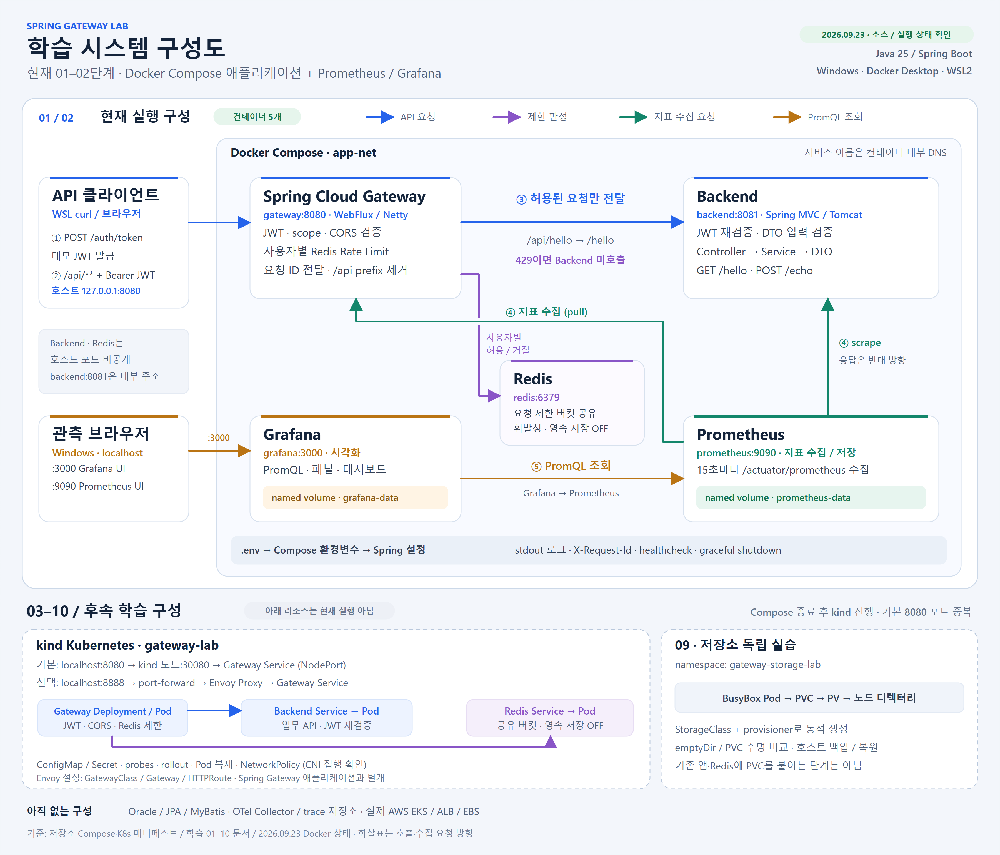

# 학습 시스템 구성도

작성·확인: 2026-09-23. 현재 저장소의 소스·설정과 Docker 실행 목록을 기준으로 작성한 스냅샷입니다.
상단은 현재 진행 중인 01–02단계 Compose 구성, 하단은 이후 kind/Kubernetes 학습 구성입니다.
현재 실행 중인 시스템에 Kubernetes·Oracle·trace 저장소가 모두 포함되어 있다고 해석하지 않습니다.

[SVG 원본 열기](diagrams/learning-system-overview.svg) · [고해상도 PNG 열기](diagrams/learning-system-overview.png)

SVG는 확대해도 선명한 벡터 파일이며 브라우저나 SVG 편집기에서 열 수 있습니다.
PNG는 3600 × 3080 크기로 문서·발표 자료에 삽입할 수 있습니다. 구성이 바뀌면 두 파일을 함께 갱신합니다.

## 현재 구성 읽기

화살표는 호출·수집 요청 방향입니다. 응답·조회 결과는 반대 방향으로 돌아오며 선의 교차는 연결 지점이 아닙니다.

1. 클라이언트는 Gateway의 `POST /auth/token`으로 로컬 데모 JWT를 발급받습니다.
2. `Authorization: Bearer ...`를 포함해 `/api/**`를 호출합니다. Gateway는 JWT·scope·CORS와 요청 ID를 처리합니다.
3. Gateway가 Redis의 사용자별 제한 버킷을 확인합니다. 허용하면 `/api`를 제거해 Backend로 전달하고, 한도 초과면 429로 끝납니다.
4. Backend는 JWT를 다시 검증하고 Controller → Service → DTO 흐름으로 요청을 처리합니다.
5. Prometheus는 두 앱의 `/actuator/prometheus`를 15초마다 가져와 저장합니다. 앱이 Grafana에 지표를 직접 보내는 구조가 아닙니다.
6. Grafana는 Prometheus에 PromQL을 보내 결과를 패널·대시보드로 표시합니다.

Redis 장애의 기본 허용 fallback은 현재 유지합니다. 한도 초과 429와 Redis 오류 시 요청별 fail-closed는 별개이며,
후자는 [후속 장애 정책](resilience-policy.md)입니다. 공통 오류 형식과 401/403/429/502/504 처리 범위는
[API 응답 계약](api-contract.md)을 참고합니다.

| Windows / WSL 호스트에서 접근 | 용도 |
|---|---|
| `http://localhost:8080` | Spring Gateway API 및 로컬 데모 토큰 발급 |
| `http://localhost:9090` | Prometheus Query / Targets UI |
| `http://localhost:3000` | Grafana UI |
| `backend:8081`, `redis:6379` | Compose 네트워크 내부 이름·포트. 호스트에 포트를 공개하지 않음 |

`expose` 자체는 접근 제어 정책이 아닙니다. Grafana 데이터 소스 URL은 컨테이너 내부 주소
`http://prometheus:9090`이며 Windows 브라우저에서 사용하는 `localhost:9090`과 구분합니다.
Prometheus `up=1`은 지표 수집 성공을 의미하며 전체 업무 API의 정상 동작까지 보장하지 않습니다.

Prometheus와 Grafana는 각각 named volume을 사용합니다. Redis는 RDB/AOF를 끈 요청 제한 실습용이며 영속 DB가 아닙니다.
환경값은 `.env → Compose environment → Spring Environment`로 전달되고, 프로젝트 설정 일부는
`@ConfigurationProperties`가 붙은 설정 객체에 바인딩됩니다. 상세 경로는 [설정 책임](package-structure.md)에 있습니다.

## 후속 학습 구성 읽기

- **03–04 · kind**: 같은 Gateway·Backend·Redis를 Deployment/Pod와 Service로 옮깁니다. ConfigMap/Secret, probes, rollout, 복제본을 실습합니다.
- **05 · 선택형 Envoy**: Gateway API 리소스로 Envoy Proxy를 설정하고 `localhost:8888` port-forward 경로를 추가합니다.
  기본 NodePort 경로도 남으며, 두 진입 경로 모두 Spring Gateway를 통과합니다. Envoy가 JWT·Redis 제한을 중복 수행하지 않습니다.
- **08 · NetworkPolicy**: Backend/Redis로 들어오는 연결을 Gateway Pod에 허용하는 정책입니다. CNI의 실제 집행 여부는 별도 대조 실험으로 확인합니다.
- **09 · 저장소**: 별도 `gateway-storage-lab` namespace에서 BusyBox·PVC·PV로 Pod 교체와 백업·복원을 실습합니다.
  기존 Backend/Redis에 영속 저장소를 붙이는 단계가 아닙니다. StorageClass/local-path provisioner의 조건은 실행 전 확인합니다.
- **10 · Spring Boot**: Stateless 인증, 설정 외부화, health, stdout 로그, graceful shutdown과 미완료 장애 정책을 함께 검증합니다.

Compose와 kind 기본 진입 포트는 모두 8080이므로 현재 Compose를 종료한 뒤 kind로 전환합니다.
Prometheus/Grafana 관측 설정은 현재 Compose용이며 kind에 자동 배포되지 않습니다.
Oracle/JPA/MyBatis, OTel Collector/trace 저장소, 실제 AWS 리소스는 현재 구성에 포함되지 않습니다.
kind는 EKS 에뮬레이터가 아니며 AWS 자원 생성은 이 무료 로컬 학습의 실행 범위 밖입니다.

## 구성도의 근거 파일

| 영역 | 소스 / 문서 |
|---|---|
| 현재 컨테이너·포트·환경변수 | [기본 Compose](../docker-compose.yml), [관측 Compose](../docker-compose.observability.yml) |
| 인증·요청 제한·Backend 라우팅 | [Gateway 설정](../gateway/src/main/resources/application.yml), [트래픽 진입 책임](traffic-entry.md) |
| 지표 수집·조회 | [Prometheus 설정](../observability/prometheus.yml), [Grafana 데이터 소스](../observability/grafana/provisioning/datasources/prometheus.yml) |
| kind / NodePort / 앱 배포 | [kind 설정](../k8s/kind-config.yaml), [기본 매니페스트](../k8s/base), [03단계](learning/03-kind-kubernetes.md) |
| Envoy / Gateway API | [선택 매니페스트](../k8s/gateway-api), [05단계](learning/05-gateway-api.md) |
| 정책·저장소·Spring Boot 검증 | [08단계](learning/08-network-policy-validation.md), [09단계](learning/09-storage-and-persistence.md), [10단계](learning/10-spring-boot-readiness.md) |

[전체 학습 순서](learning/README.md)
